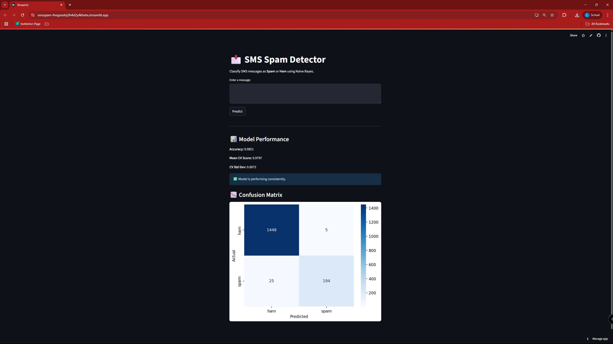

## SMS Spam Detector

A simple web application built with Streamlit that classifies SMS messages as spam or ham using a Naive Bayes classifier.

## Screenshot

## How to Run Locally

1. Clone the repository
2. Install dependencies: pip install -r requirements.txt
3. Run the app:

## Live App

🔗 [Click here to open the live app](https://smsspam-fnegseslnj3h4d2y4khete.streamlit.app)

